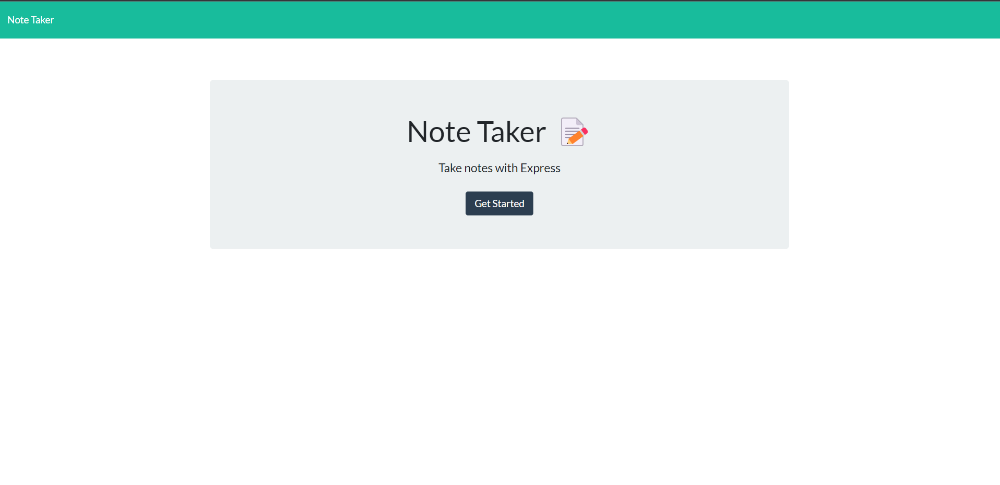
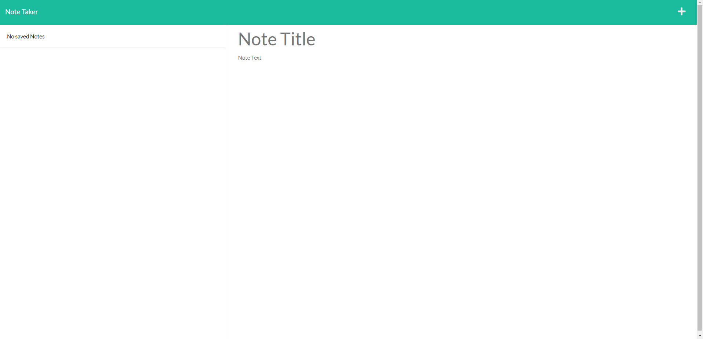

# Notes Worth Taking

## Description

This is an app that alous the user to take notes and save them to a data base

## Table of Contents

[Description](#description)

[Instalation](#instalation)

[Usage](#usage)

[Photos](#photos)

[Contributing](#contributing)

[Test](#test)

[Questions](#questions)

[License](#license)

## Usage

This app can be used to take notes save them to a database and read the nots later as well as  delet old notes

## Photos

## Questions

For any questions contact me at

jettc505@gmail.com

[My GitHub: Jett65](https://github.com/Jett65)
